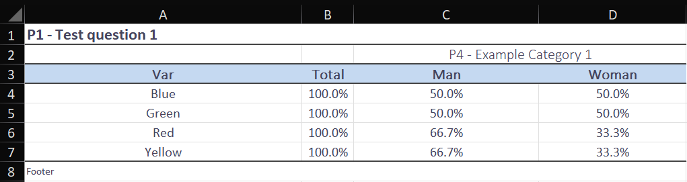

# Tabulation generator (output tabulations for publication) from a Pandas DataFrame)

This repository automates the creation of output tabulations in .xlsx files from a Pandas DataFrame.

You can define styles for the tabulations (font type, font size, gradient colors, borders, etc.),
sections or pages of the Excel workbook where the tabulations will be inserted, select the variables to be tabulated
from the DataFrame, the cross or secondary variables with which the selected variables will be disaggregated, and
establish how the data will be presented (in absolute values, in total percentages, in percentages by columns, or
in percentages by rows).

## What does this repository do?
This repository starts from a database loaded in DataFrame format in Pandas and with the definition of a settings
DataFrame:
(For example)

With these settings and by defining the table styles in the 'config_style.json' file, the order in which the
disaggregation or secondary variables should be cataloged (optional) in the 'config_values.json' file, and the
'table_type' variable in main.py, you can obtain the following results:

#### table_type = 0 (Absolute value)

#### table_type = 1 (%total)

#### table_type = 2 (%columns)

#### table_type = 3 (%rows)

## How does the code work?

This repository uses the Pandas and openpyxl libraries to create a class called ExcelFile, which contains all the logic
responsible for creating, formatting, and inserting the data to be tabulated into a .xlsx file. The data is processed
by the 'main_logic.py' file using functions from 'utilities.py' during the process.

In summary, with this repository, you can create output tabulations for any database using Python and Pandas,
specifying in the corresponding files the styles, data format, and variable operations (supporting multiplication
instruction to express numerical values expanded by an expansion factor, all of which is optional).
