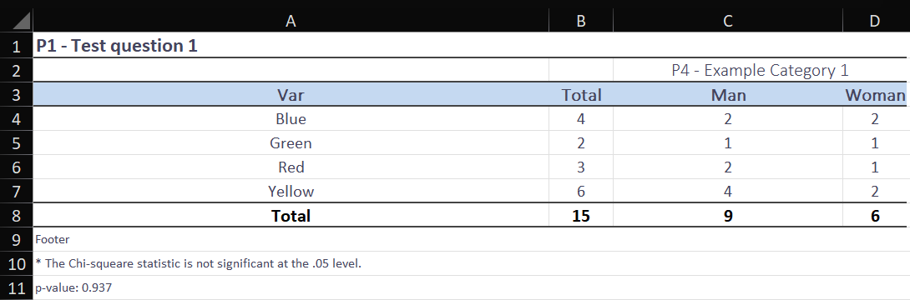

# Tabulation Generator (Output Tabulations for Publication) from a Pandas DataFrame

This repository automates the creation of output tabulations in .xlsx files from a Pandas DataFrame. You can define styles for the tabulations (font type, font size, gradient colors, borders, etc.), sections or pages of the Excel workbook where the tabulations will be inserted, select the variables to be tabulated from the DataFrame, the cross or secondary variables with which the selected variables will be disaggregated, and establish how the data will be presented (in absolute values, in total percentages, in percentages by columns, or in percentages by rows).

## What Does This Repository Do?

This repository starts from a database loaded in DataFrame format in Pandas and with the definition of a settings DataFrame:

### Example

| VAR                      | PAGE | SUM                                               | DISAGGREGATE |
|--------------------------|------|---------------------------------------------------|--------------|
| P1 - Test question 1     | 1    | Expansion_factor                                  | FALSE        | 
| P1 - Test question 1     | 1    | P2 - Test question 2,${multiply},Expansion_factor | FALSE        |
| P3 - Test question 3     | 1    | Expansion_factor                                  | FALSE        | 
| P4 - Example Category 1  | 2    | Expansion_factor                                  | TRUE         |
| P5 - Example Category 2  | 2    | Expansion_factor                                  | TRUE         |

With these settings and by defining the table styles in the `config_style.json` file, the order in which the disaggregation or secondary variables should be cataloged (optional) in the `config_values.json` file, and the `table_type` variable in `main.py`, you can obtain the following results:

### Table Types

#### table_type = 0 (Absolute value)

#### table_type = 1 (%total)

#### table_type = 2 (%columns)

#### table_type = 3 (%rows)

#### table_type = 4 (Simple absolute value and % total)

## How Does the Code Work?

Adjustments should only be made to the `start_code` function in the `main.py` file by specifying the name of the Excel file to be generated (`db_name`), the type of tables to be generated (`table_type`), the dataframe with the data to be tabulated (`db`), the dataframe with the adjustment data for processing the tables (`db_vars`), and optionally a filter for the dataframe (`Split_df_by`) and a footer text for each table (`footer_text`).

## What's New?

### Latest Adjustments:
**22/05/2024**

- **Simple Tables**: Added the option to produce simple tables without crossing with any variable, where data is presented in quantities and percentages (option 4 in the `table_type` variable).
- **Bug Fixes**: Fixed a bug in the code when calculating totals for variables that have blank values.
- **Value Sorting**: Improved the code so that the values in the `Var` column of the output tables are also sorted according to the order specified in the `config_values.json` file.
- **Chi-Squared Test**: In the absolute values option (option 0 in the `table_type` variable), added the chi-squared test to evaluate the degree of independence between variables.
- **Variable Operations**: Modified the logic of the instructions placed in the `SUM` column of `db_vars` to support the specification of variables to operate. It is now possible to use the multiplication of two variables as a factor by passing the value `Variable 1,${multiply},Variable 2`.

**23/05/2024**

- **Total row**: Added a totals row to all tables except %rows (`table_type=3`).
- **Bug Fixes**: Fixed an error in the code that originated when adding the simple tables option.
